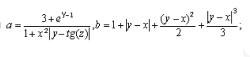

Условия задачи:



В данной задаче, как в первой из всего списка, стоит рассмотреть каждую строку кода подробно.

```C
#include <stdio.h>
#include <math.h>
```

Эти две строки подключают к программе две стандартные библиотеки языка **С**. Чтобы узнать, что это за библиотеки, можно процитировать Wikipedia: 
<math.h> - Для вычисления основных математических функций.
<stdio.h> - Реализует основные возможности ввода и вывода в языке Си. Этот файл содержит весьма важную функцию `printf`.


`int main()` - объявляем функцию.
`float x, y, z, result_a, result_b;` - объявляем переменные, и им присваиваем тип float

```C
    printf("Please input x: ");
    scanf("%f", &x);

    printf("Please input y: ");
    scanf("%f", &y);

    printf("Please input z: ");
    scanf("%f", &z);
```

В этой части мы выводим просьбу ввести определённое число, после чего присваиваем число переменной. Так происходит 3 раза. Пользователь обязан ввести какое-то число, при том оно может быть дробным.


```C
result_a = (3 + exp(y - 1)) / (1 + (pow(x, 2)*abs(y - tan(z))));

result_b = (1 + abs(y - x)) + (pow(y - x, 2) / 2) + (pow(abs(y - x), 3) / 3);
```

Здесь - формулы из задачника. Мы используем введённые пользователем переменные и высчитываем новые значения. 
Новые функции: `pow` - возведение в степень, `exp` - степень числа Эйлера, `abs` - модуль числа, `tan` - тангенс числа.


```C
    printf("Result A: %f\n", result_a);
    printf("Result B: %f\n", result_b);

    // Outputs a result
    return 0;
```

Выводим результат и возвращаем 0 - функция отрабатала успешно.

Исходный код: 
```C
#include <stdio.h>
#include <math.h>

  

int main() {
float x, y, z, result_a, result_b;
// Initializing variables as float

printf("Please input x: ");
scanf("%f", &x);

printf("Please input y: ");
scanf("%f", &y);

printf("Please input z: ");
scanf("%f", &z);
// User inputs 3 variables

result_a = (3 + exp(y - 1)) / (1 + (pow(x, 2)*abs(y - tan(z))));
result_b = (1 + abs(y - x)) + (pow(y - x, 2) / 2) + (pow(abs(y - x), 3) / 3);
// Calculating 2 results

printf("Result A: %f\n", result_a);
printf("Result B: %f\n", result_b);
// Outputs a result

return 0;
// No errors: returns 0
}
```
### [[Report (2 task)|Следующий отчёт]]