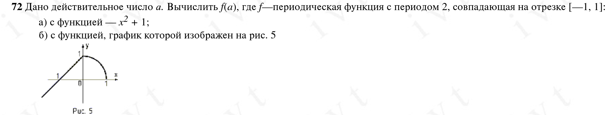

Условия задачи:
(выполняем под буквой "а")



Исходный код:
```C
#include <stdio.h>
#include <math.h> // Including libraries

int main() {
float a, result, interval; // Initializing variables
interval = 2; // Period of periodic fucntion = 2

puts("Введите а:");
scanf("%f", &a);
// User inputs a real number a

while ((a > 1) || (a < -1)){
if (a > 1) {
a = a - interval;
} else {
a = a + interval;
}
} 
// Checks where is a for basic interval

result = pow(a, 2) + 1; // Formula for function

printf("Относительно начальных условий, а находится на: %f\n", a);
printf("Y = %f", result);
return 0;
}
```

