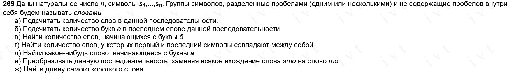

Условия задачи: 



Исходный код:

```C
#include <stdio.h>
#include <stdlib.h>
#include <string.h>

int is_utf8_a(const unsigned char *s) {
    return s[0] == 0xD0 && s[1] == 0xB0;
}

int main() {
    int n;
    printf("Введите n: ");
    if (scanf("%d", &n) != 1 || n <= 0) {
        fprintf(stderr, "Введите целое положительное число.\n");
        return 1;
    }

    n = n * 2; // Учитываем 2 байта на символ (для кириллицы в UTF-8)
    getchar(); // Удаляем '\n' после ввода числа

    // Выделяем память под строку
    char *s = (char *)calloc(n + 1, sizeof(char));
    if (!s) {
        fprintf(stderr, "Ошибка выделения памяти.\n");
        return 1;
    }
  
    printf("Введите строку: ");
    if (!fgets(s, n + 1, stdin)) {
        fprintf(stderr, "Ошибка при чтении строки.\n");
        free(s);
        return 1;
    }
  
    // Удаляем '\n', если он остался
    s[strcspn(s, "\n")] = '\0';
  
    // Поиск конца последнего слова
    int end = strlen(s) - 1;
    while (end >= 0 && s[end] == ' ')
        end--;
  
    if (end < 0) {
        printf("0\n");
        free(s);
        return 0;
    }

    // Поиск начала последнего слова
    int start = end;
    while (start >= 0 && s[start] != ' ')
        start--;
  
    int count = 0;
    for (int i = start + 1; i < end; i++) {
        if (is_utf8_a((unsigned char *)&s[i])) {
            count++;
            i++; // пропускаем второй байт
        }
    }
    
    printf("%d\n", count);
    free(s);
    return 0;
}
```