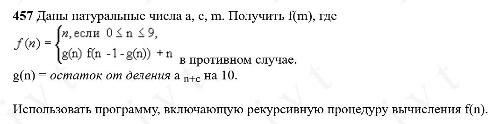

Условия задачи:



Исходный код модуля:

```C
// Function g: Helper function that performs a linear congruential operation
// Parameters:
//   n - input value
//   a - multiplier
//   c - increment
// Returns: (a * n + c) mod 10
int g(int n, int a, int c) {
    return (a * n + c) % 10;
}

// Function f: Recursive function that computes a value based on input n
// Parameters:
//   n - input value
//   a - multiplier used in function g
//   c - increment used in function g
// Returns:
//   - n if n is between 0-9 (base case)
//   - Otherwise, a recursive computation involving g(n) and f(n-1-g(n))
int f(int n, int a, int c){
    if (n >= 0 && n <= 9) {
        // Base case: return n directly if it's a single digit
    return n;
    }
    else {
        // Recursive case:
        // 1. Compute g(n)
        int gn = g(n, a, c);
        // 2. Return a combination of g(n), recursive call, and n
        return (gn * (f(n - 1 - gn, a, c)) + n);
    }
}
```

Исходный код main-файла:

```C
#include <stdio.h>
#include "module.c"

// Прототипы функций
int g(int n, int a, int c);
int f(int n, int a, int c);
  
int main() {
    int m, a, c;
    printf("Input 'n', 'a' and 'c': ");
    scanf("%d%d%d", &m, &a, &c);

    if (m < 0) {
        printf("Error: 'n' must be non-negative.\n");
        return 1;
    }

    int result = f(m, a, c);
    printf("Result is: %d\n", result);
    return 0;
}
```