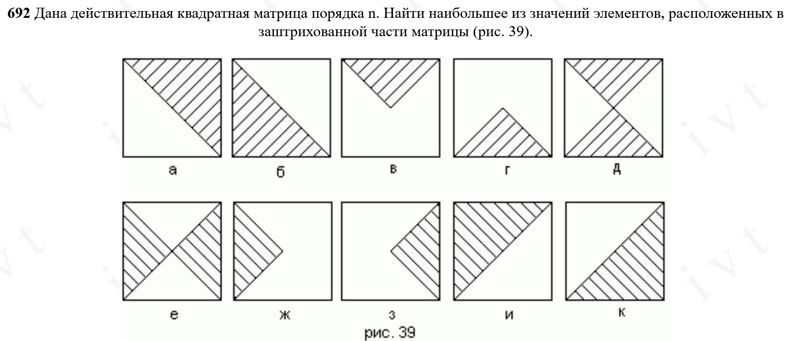

Условия задачи: (под буквой "б")



```C
#include <stdio.h>
#include <stdlib.h>
#include <time.h>  // For srand() and rand() functions
  
int main() {
    int n;          // Variable to store matrix size
    double max;     // Variable to store maximum value

    // Prompt user to input matrix size
    printf("Input size of n-matrix (square matrix): ");
    scanf("%d", &n);
  
    // Validate matrix size
    if (n <= 1) {
        printf("Invalid array size!\n");
        return 1;   // Exit with error code
    }

    // Allocate memory for the matrix (array of pointers)
    double **arr = (double **)malloc(n * sizeof(double *));
    if (arr == NULL) {
        printf("Memory allocation failed!\n");
        return 1;   // Exit if allocation fails
    }

    // Allocate memory for each row of the matrix
    for (int i = 0; i < n; i++) {
        arr[i] = (double *)malloc(n * sizeof(double));
        if (arr[i] == NULL) {
            printf("Memory allocation failed!\n");
            // Free previously allocated memory before exiting

            for (int j = 0; j < i; j++) free(arr[j]);
            free(arr);
            return 1;
        }
    }

    // Seed the random number generator with current time
    srand(time(NULL));

    // Fill the matrix with random numbers between 0 and 99
    for (int i = 0; i < n; i++) {
        for (int j = 0; j < n; j++) {
            arr[i][j] = rand() % 100;  // Generate numbers 0-99
        }
    }

    // Print the matrix
    printf("\nMatrix:\n");
    for (int i = 0; i < n; i++) {
        for (int j = 0; j < n; j++) {
            printf("%6.0f", arr[i][j]);  // Format as integers (no decimal places)
        }
        printf("\n");  // New line after each row
    }

    // Find maximum value below and on the main diagonal
    max = arr[0][0];  // Initialize max with first element
    for (int i = 0; i < n; i++) {
        // Only check elements where column index <= row index
        for (int j = 0; j <= i; j++) {
            if (arr[i][j] > max) {
                max = arr[i][j];  // Update max if larger value found

            }

        }

    }

  

    // Print the maximum value found

    printf("\nMaximum value below and on the main diagonal: %.0f\n", max);

  

    // Free allocated memory

    for (int i = 0; i < n; i++) free(arr[i]);  // Free each row

    free(arr);  // Free the array of pointers

  

    return 0;  // Successful program termination

}
```